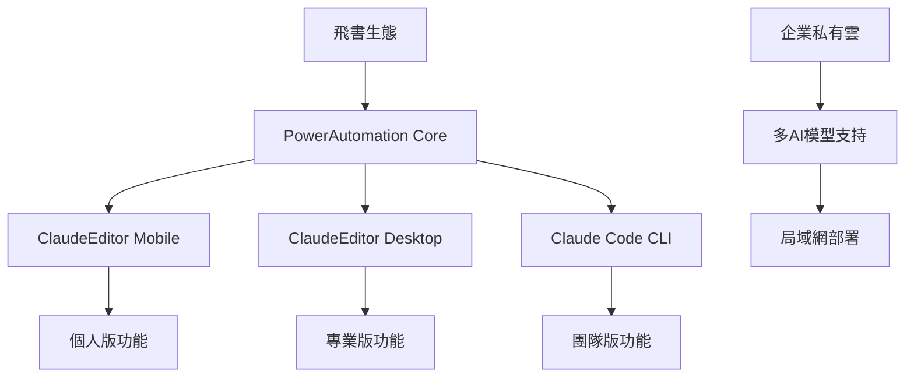

# PowerAutomation + ClaudeEditor 五階段整合實施計劃

## 🎯 整合概述

基於PowerAutomation v4.6.9與ClaudeEditor的深度整合，結合飛書生態系統，打造從個人開發者到企業級的完整AI開發解決方案。

---

## 📋 整合架構設計

### 核心整合組件


### 版本功能矩陣
| 功能類別 | 個人版 | 專業版 | 團隊版 | 企業版 |
|---------|--------|--------|--------|--------|
| **ClaudeEditor Mobile** | 基礎版 | 完整版 | 協作版 | 企業版 |
| **ClaudeEditor Desktop** | 本地編輯 | Claude Code集成 | 團隊協作 | 私有雲 |
| **NPM包訪問** | 基礎包 | 增強包 | 協作包 | 完整包 |
| **AI模型支持** | Claude基礎 | Claude高級 | 多模型 | 私有部署 |
| **CLI工具** | Claude Code | Claude Code Pro | 多CLI支持 | 企業CLI套件 |

---

## 🚀 五階段實施計劃

### Phase 0: 飛書生態與購買系統 (v4.6.10)
**時間**: 3週 | **優先級**: 🔴 極高 | **負責團隊**: 前端+後端+產品

#### Week 1: 飛書小程序開發
**目標**: 建立飛書內購買和推廣入口

##### 技術任務
- [ ] **飛書小程序開發**
  ```javascript
  // 飛書購買入口集成
  const FEISHU_CONFIG = {
    appToken: "AmfoKtFagQATaHK7JJIAQAI%3D",
    purchaseFlow: {
      personal: { price: 0, trial: "30天" },
      professional: { price: 39, features: ["Mobile+Desktop Editor"] },
      team: { price: 129, features: ["協作功能", "多設備同步"] },
      enterprise: { price: 499, features: ["私有雲", "多AI模型"] }
    }
  }
  ```

- [ ] **支付系統整合**
  - 微信支付 SDK 集成
  - 支付寶 SDK 集成  
  - PayPal 國際支付
  - Stripe 企業支付
  - 自動許可證生成API

##### 前端開發
- [ ] **飛書小程序UI設計**
  - 產品介紹頁面
  - 版本對比表
  - ClaudeEditor演示視頻
  - 購買流程設計

- [ ] **響應式支付頁面**
  - 移動端適配
  - 多語言支持 (中文/英文)
  - 支付狀態跟踪

##### 後端開發
- [ ] **許可證管理系統**
  ```python
  class LicenseManager:
      def generate_license(self, user_id, edition, payment_info):
          license_key = self.create_jwt_token(user_id, edition)
          self.store_license(license_key, payment_info)
          self.send_feishu_notification(user_id, license_key)
          return license_key
  ```

- [ ] **飛書用戶綁定**
  - 飛書 OAuth 2.0 集成
  - 用戶身份驗證
  - 團隊管理功能

#### Week 2: NPM包生態系統
**目標**: 建立分級NPM包發布策略

##### NPM包架構設計
```json
{
  "@powerautomation/core": {
    "version": "4.6.10",
    "editions": {
      "personal": "基礎MCP組件 + 基礎工作流",
      "professional": "增強MCP組件 + API開發工作流", 
      "team": "高級MCP組件 + 完整工作流",
      "enterprise": "全部MCP組件 + 自定義工作流"
    }
  },
  "@powerautomation/claude-editor-mobile": {
    "platforms": ["iOS", "Android"],
    "features": {
      "personal": ["基礎編輯", "雲端同步"],
      "professional": ["Claude Code集成", "智能補全"],
      "team": ["實時協作", "版本控制"],
      "enterprise": ["離線模式", "企業安全"]
    }
  },
  "@powerautomation/claude-editor-desktop": {
    "platforms": ["Windows", "macOS", "Linux"],
    "integration": {
      "claude_code_cli": "深度集成",
      "local_ai_models": "企業版專屬",
      "team_collaboration": "團隊版以上"
    }
  }
}
```

##### 包版本控制策略
- [ ] **自動化發布流程**
  ```yaml
  # GitHub Actions 配置
  name: NPM Package Release
  on:
    push:
      tags: ['v*']
  jobs:
    publish:
      runs-on: ubuntu-latest
      strategy:
        matrix:
          package: [core, mobile-editor, desktop-editor, enterprise-cli]
  ```

- [ ] **版本權限控制**
  - 許可證驗證中間件
  - 功能級訪問控制
  - 使用量統計追踪

#### Week 3: ClaudeEditor集成開發
**目標**: 完成Mobile/Desktop ClaudeEditor與PowerAutomation集成

##### Mobile ClaudeEditor開發
- [ ] **iOS應用開發**
  ```swift
  // iOS ClaudeEditor 集成
  class PowerAutomationSDK {
      func initializeWithLicense(_ license: String) {
          self.validateLicense(license)
          self.loadEditionFeatures()
          self.setupClaudeCodeIntegration()
      }
  }
  ```

- [ ] **Android應用開發**
  ```kotlin
  // Android ClaudeEditor 集成
  class PowerAutomationManager {
      fun initialize(license: String, edition: Edition) {
          licenseValidator.validate(license)
          featureManager.loadFeatures(edition)
          claudeCodeBridge.connect()
      }
  }
  ```

##### Desktop ClaudeEditor開發
- [ ] **Electron應用框架**
  ```javascript
  // Desktop ClaudeEditor 主進程
  const { app, BrowserWindow } = require('electron');
  const PowerAutomationCore = require('@powerautomation/core');
  
  class ClaudeEditorDesktop {
      constructor() {
          this.powerAutomation = new PowerAutomationCore();
          this.claudeCodeCLI = new ClaudeCodeIntegration();
      }
  }
  ```

- [ ] **Claude Code CLI深度集成**
  - 命令行工具嵌入
  - 智能代碼補全
  - 實時錯誤檢查
  - 工作流自動化

##### 跨平台功能同步
- [ ] **雲端同步服務**
  - 項目文件同步
  - 設置偏好同步  
  - 工作進度同步
  - 協作狀態同步

### Phase 1: 核心配額系統增強 (v4.7.0)
**時間**: 2週 | **優先級**: 🔴 高 | **負責團隊**: 後端+DevOps

#### Week 1: 許可證與配額系統
**目標**: 建立跨平台統一的許可證和配額管理

##### 統一許可證系統
```python
class UnifiedLicenseManager:
    """統一許可證管理器 - 支持飛書、Mobile、Desktop"""
    
    def __init__(self):
        self.platforms = ['feishu', 'mobile', 'desktop', 'web']
        self.redis_client = redis.Redis()
        
    def validate_cross_platform_license(self, user_id: str, platform: str) -> Dict:
        """跨平台許可證驗證"""
        license_info = self.get_license_info(user_id)
        platform_features = self.get_platform_features(license_info.edition, platform)
        
        return {
            'valid': True,
            'edition': license_info.edition,
            'platform_features': platform_features,
            'remaining_quota': self.get_remaining_quota(user_id),
            'sync_token': self.generate_sync_token(user_id)
        }
    
    def get_platform_features(self, edition: str, platform: str) -> Dict:
        """獲取平台特定功能"""
        feature_matrix = {
            'mobile': {
                'personal': ['basic_editing', 'cloud_sync'],
                'professional': ['claude_integration', 'smart_completion'],
                'team': ['collaboration', 'version_control'],
                'enterprise': ['offline_mode', 'enterprise_security']
            },
            'desktop': {
                'personal': ['local_editing', 'basic_tools'],
                'professional': ['claude_cli_integration', 'advanced_tools'],
                'team': ['team_collaboration', 'shared_projects'],
                'enterprise': ['local_ai_models', 'private_deployment']
            }
        }
        return feature_matrix.get(platform, {}).get(edition, [])
```

##### 跨設備配額同步
- [ ] **Redis集群配置**
  ```redis
  # 配額同步配置
  SET user:{user_id}:quota:mobile {quota_data}
  SET user:{user_id}:quota:desktop {quota_data}
  SET user:{user_id}:quota:web {quota_data}
  
  # 跨設備同步鎖
  SET user:{user_id}:sync_lock {timestamp} EX 30
  ```

- [ ] **實時配額檢查API**
  ```python
  @app.route('/api/quota/check', methods=['POST'])
  def check_quota():
      user_id = request.json['user_id']
      platform = request.json['platform']
      resource_type = request.json['resource_type']
      
      quota_info = quota_manager.check_cross_platform_quota(
          user_id, platform, resource_type
      )
      
      return jsonify(quota_info)
  ```

#### Week 2: 增強用戶界面與通知
**目標**: 優化跨平台用戶體驗和通知系統

##### 統一用戶界面組件
- [ ] **React組件庫**
  ```jsx
  // 統一配額顯示組件
  const QuotaDisplay = ({ userId, platform }) => {
      const [quota, setQuota] = useState(null);
      
      useEffect(() => {
          fetchQuotaInfo(userId, platform).then(setQuota);
      }, [userId, platform]);
      
      return (
          <div className="quota-display">
              <QuotaBar current={quota.used} max={quota.limit} />
              <UpgradeButton show={quota.nearLimit} />
              <FeishuPurchaseLink />
          </div>
      );
  };
  ```

- [ ] **飛書消息推送系統**
  ```python
  class FeishuNotificationService:
      def send_quota_warning(self, user_id: str, quota_type: str, usage_percent: float):
          """發送配額警告到飛書"""
          message = {
              "msg_type": "interactive",
              "card": {
                  "header": {"title": {"content": "PowerAutomation 配額提醒"}},
                  "elements": [
                      {"tag": "div", "text": f"{quota_type} 使用率已達 {usage_percent}%"},
                      {"tag": "action", "actions": [
                          {"tag": "button", "text": "立即升級", "url": self.upgrade_url}
                      ]}
                  ]
              }
          }
          self.send_to_feishu(user_id, message)
  ```

### Phase 2: 工作流分級與AI模型集成 (v4.7.5)
**時間**: 3週 | **優先級**: 🔴 高 | **負責團隊**: AI+後端+前端

#### Week 1: 工作流權限系統
**目標**: 實現跨平台工作流分級訪問

##### 工作流執行引擎
```python
class CrossPlatformWorkflowEngine:
    """跨平台工作流執行引擎"""
    
    def __init__(self):
        self.mobile_executor = MobileWorkflowExecutor()
        self.desktop_executor = DesktopWorkflowExecutor()
        self.web_executor = WebWorkflowExecutor()
        
    async def execute_workflow(self, workflow_request: WorkflowRequest) -> WorkflowResult:
        """執行跨平台工作流"""
        # 權限檢查
        if not self.check_workflow_permission(workflow_request):
            raise PermissionError("Workflow access denied")
            
        # 平台適配
        executor = self.get_platform_executor(workflow_request.platform)
        
        # 執行工作流
        result = await executor.execute(workflow_request)
        
        # 同步結果到其他平台
        await self.sync_workflow_result(workflow_request.user_id, result)
        
        return result
    
    def check_workflow_permission(self, request: WorkflowRequest) -> bool:
        """檢查工作流執行權限"""
        user_edition = self.get_user_edition(request.user_id)
        workflow_requirements = WORKFLOW_REQUIREMENTS[request.workflow_name]
        
        return self.edition_level[user_edition] >= workflow_requirements['min_level']
```

##### 分級工作流定義
```yaml
# 工作流分級配置
workflows:
  code_generation:
    min_edition: personal
    features:
      personal: [basic_templates, simple_completion]
      professional: [advanced_templates, context_aware]
      team: [collaborative_editing, shared_templates]
      enterprise: [custom_templates, ai_model_selection]
      
  ui_design:
    min_edition: personal
    features:
      personal: [basic_components, preset_themes]
      professional: [custom_components, responsive_design]
      team: [design_system, collaborative_design]
      enterprise: [brand_guidelines, advanced_customization]
      
  api_development:
    min_edition: professional
    platforms:
      mobile: [rest_client, api_testing]
      desktop: [full_postman_integration, swagger_generation]
      web: [interactive_documentation, team_sharing]
```

#### Week 2: AI模型分級與路由
**目標**: 實現AI模型的分級訪問和智能路由

##### AI模型路由系統
```python
class AIModelRouter:
    """AI模型智能路由系統"""
    
    def __init__(self):
        self.model_configs = {
            'claude_basic': {
                'editions': ['personal', 'professional', 'team', 'enterprise'],
                'context_length': 4096,
                'cost_per_token': 0.001
            },
            'claude_advanced': {
                'editions': ['professional', 'team', 'enterprise'],
                'context_length': 8192,
                'cost_per_token': 0.002
            },
            'claude_enterprise': {
                'editions': ['enterprise'],
                'context_length': 32768,
                'cost_per_token': 0.005,
                'private_deployment': True
            }
        }
    
    async def route_request(self, ai_request: AIRequest) -> AIResponse:
        """智能路由AI請求"""
        user_edition = await self.get_user_edition(ai_request.user_id)
        available_models = self.get_available_models(user_edition)
        
        # 根據請求類型和用戶版本選擇最佳模型
        selected_model = self.select_optimal_model(
            ai_request, available_models, user_edition
        )
        
        # 檢查配額
        if not await self.check_ai_quota(ai_request.user_id, selected_model):
            return AIResponse(error="AI quota exceeded")
        
        # 執行AI請求
        response = await self.execute_ai_request(ai_request, selected_model)
        
        # 更新使用統計
        await self.update_usage_stats(ai_request.user_id, selected_model, response)
        
        return response
```

##### 跨平台AI集成
- [ ] **Mobile AI集成**
  ```swift
  // iOS AI服務集成
  class AIServiceManager {
      func processRequest(_ request: AIRequest) async -> AIResponse {
          let routedRequest = await routeToOptimalModel(request)
          return await executeAIRequest(routedRequest)
      }
  }
  ```

- [ ] **Desktop AI集成**
  ```javascript
  // Desktop AI服務集成
  class DesktopAIService {
      async processAIRequest(request) {
          const model = await this.selectModel(request);
          const response = await this.callAIService(model, request);
          await this.updateLocalCache(response);
          return response;
      }
  }
  ```

#### Week 3: 企業自定義工作流編輯器
**目標**: 為企業版開發可視化工作流編輯器

##### 可視化工作流設計器
```typescript
interface WorkflowNode {
    id: string;
    type: 'ai_model' | 'code_gen' | 'ui_design' | 'api_call' | 'data_transform';
    position: { x: number, y: number };
    data: {
        label: string;
        config: Record<string, any>;
        inputs: WorkflowInput[];
        outputs: WorkflowOutput[];
    };
}

class VisualWorkflowEditor {
    private canvas: HTMLCanvasElement;
    private nodes: Map<string, WorkflowNode> = new Map();
    private connections: WorkflowConnection[] = [];
    
    constructor(canvasElement: HTMLCanvasElement) {
        this.canvas = canvasElement;
        this.initializeEditor();
    }
    
    addNode(type: string, position: { x: number, y: number }): WorkflowNode {
        const node: WorkflowNode = {
            id: generateId(),
            type: type as any,
            position,
            data: this.getDefaultNodeData(type)
        };
        
        this.nodes.set(node.id, node);
        this.renderNode(node);
        return node;
    }
    
    async executeWorkflow(): Promise<WorkflowResult> {
        const execution_plan = this.generateExecutionPlan();
        return await this.workflowEngine.execute(execution_plan);
    }
}
```

### Phase 3: 部署平台控制與企業集成 (v4.8.0)
**時間**: 4週 | **優先級**: 🟡 中 | **負責團隊**: DevOps+後端

#### Week 1-2: 部署平台分級系統
**目標**: 實現分級部署平台訪問控制

##### 部署平台管理器
```python
class DeploymentPlatformManager:
    """部署平台分級管理"""
    
    def __init__(self):
        self.platform_configs = {
            'personal': {
                'platforms': ['local'],
                'monthly_deployments': 10,
                'concurrent_deployments': 1,
                'features': ['basic_build', 'local_preview']
            },
            'professional': {
                'platforms': ['local', 'web_browser', 'pwa', 'webassembly'],
                'monthly_deployments': 50,
                'concurrent_deployments': 3,
                'features': ['optimized_build', 'cdn_hosting', 'custom_domain']
            },
            'team': {
                'platforms': ['all_standard_platforms'],
                'monthly_deployments': 200,
                'concurrent_deployments': 10,
                'features': ['team_deployments', 'staging_environments', 'rollback']
            },
            'enterprise': {
                'platforms': ['unlimited'],
                'monthly_deployments': -1,
                'concurrent_deployments': -1,
                'features': ['private_deployment', 'custom_scripts', 'compliance']
            }
        }
    
    async def deploy_application(self, deployment_request: DeploymentRequest) -> DeploymentResult:
        """執行應用部署"""
        # 驗證部署權限
        if not await self.validate_deployment_permission(deployment_request):
            raise PermissionError("Deployment platform access denied")
        
        # 選擇部署策略
        deployment_strategy = self.select_deployment_strategy(deployment_request)
        
        # 執行部署
        result = await self.execute_deployment(deployment_request, deployment_strategy)
        
        # 更新部署統計
        await self.update_deployment_stats(deployment_request.user_id, result)
        
        return result
```

##### 企業級部署配置
- [ ] **私有雲部署腳本**
  ```bash
  #!/bin/bash
  # 企業級私有雲部署腳本
  
  # 環境檢查
  check_enterprise_environment() {
      echo "檢查企業級部署環境..."
      check_kubernetes_cluster
      check_ai_model_access
      check_security_compliance
  }
  
  # AI模型部署
  deploy_ai_models() {
      echo "部署企業級AI模型..."
      deploy_claude_enterprise
      deploy_local_kimi_k2
      deploy_gemini_private_instance
      deploy_grok_integration
  }
  
  # 應用部署
  deploy_powerautomation_enterprise() {
      kubectl apply -f enterprise-deployment.yaml
      setup_load_balancer
      configure_ssl_certificates
      setup_monitoring_dashboard
  }
  ```

#### Week 3-4: 企業級功能開發
**目標**: 開發企業專屬功能和管理工具

##### 企業管理控制台
```typescript
interface EnterpriseConsole {
    // 用戶管理
    userManagement: {
        addUser(user: EnterpriseUser): Promise<void>;
        removeUser(userId: string): Promise<void>;
        assignRoles(userId: string, roles: Role[]): Promise<void>;
        auditUserActivity(userId: string): Promise<UserActivity[]>;
    };
    
    // 資源管理
    resourceManagement: {
        setQuotaLimits(quotas: QuotaConfig): Promise<void>;
        monitorUsage(): Promise<UsageReport>;
        optimizeResourceAllocation(): Promise<OptimizationSuggestion[]>;
    };
    
    // 安全管理
    securityManagement: {
        configureSSOProvider(provider: SSOConfig): Promise<void>;
        setupAuditLogging(config: AuditConfig): Promise<void>;
        generateComplianceReport(): Promise<ComplianceReport>;
    };
}

class EnterpriseConsoleImpl implements EnterpriseConsole {
    // 實現企業管理功能...
}
```

### Phase 4: 監控分析與API分級 (v4.8.5)
**時間**: 3週 | **優先級**: 🟡 中 | **負責團隊**: 數據+後端

#### Week 1: 分級監控系統
**目標**: 建立分級監控和數據分析系統

##### 監控數據收集
```python
class TieredMonitoringSystem:
    """分級監控系統"""
    
    def __init__(self):
        self.retention_policies = {
            'personal': {'days': 7, 'metrics': ['basic_usage', 'errors']},
            'professional': {'days': 30, 'metrics': ['usage', 'performance', 'errors']},
            'team': {'days': 90, 'metrics': ['detailed_usage', 'performance', 'collaboration']},
            'enterprise': {'days': 365, 'metrics': ['comprehensive', 'security', 'compliance']}
        }
    
    async def collect_metrics(self, user_id: str, platform: str, metrics: Dict) -> None:
        """收集用戶指標"""
        user_edition = await self.get_user_edition(user_id)
        retention_policy = self.retention_policies[user_edition]
        
        # 過濾指標
        filtered_metrics = self.filter_metrics_by_edition(metrics, user_edition)
        
        # 存儲指標
        await self.store_metrics(user_id, platform, filtered_metrics, retention_policy)
        
        # 觸發告警檢查
        await self.check_alerts(user_id, filtered_metrics)
    
    def generate_analytics_dashboard(self, user_id: str) -> Dict:
        """生成分析儀表板"""
        user_edition = await self.get_user_edition(user_id)
        
        if user_edition == 'personal':
            return self.generate_basic_dashboard(user_id)
        elif user_edition == 'professional':
            return self.generate_professional_dashboard(user_id)
        elif user_edition == 'team':
            return self.generate_team_dashboard(user_id)
        else:  # enterprise
            return self.generate_enterprise_dashboard(user_id)
```

#### Week 2-3: API計費與限流系統
**目標**: 實現API調用的計費和限流機制

##### API網關與限流
```python
class APIGateway:
    """API網關與限流系統"""
    
    def __init__(self):
        self.rate_limits = {
            'personal': {'requests_per_hour': 100, 'burst': 10},
            'professional': {'requests_per_hour': 1000, 'burst': 50},
            'team': {'requests_per_hour': 5000, 'burst': 200},
            'enterprise': {'requests_per_hour': -1, 'burst': -1}
        }
    
    async def process_api_request(self, request: APIRequest) -> APIResponse:
        """處理API請求"""
        # 用戶認證
        user_info = await self.authenticate_user(request.headers['authorization'])
        
        # 檢查限流
        if not await self.check_rate_limit(user_info.user_id, user_info.edition):
            return APIResponse(status=429, error="Rate limit exceeded")
        
        # 檢查API配額
        if not await self.check_api_quota(user_info.user_id, request.endpoint):
            return APIResponse(status=402, error="API quota exceeded")
        
        # 執行請求
        response = await self.execute_request(request)
        
        # 記錄計費
        await self.record_billing(user_info.user_id, request, response)
        
        return response
```

### Phase 5: 企業級功能與私有雲部署 (v4.9.0)
**時間**: 8週 | **優先級**: 🟢 中 | **負責團隊**: 全團隊

#### Week 1-2: 企業版CLI工具集
**目標**: 開發統一的企業版CLI工具

##### 多AI模型CLI統一接口
```python
class UnifiedCLIManager:
    """統一CLI管理器"""
    
    def __init__(self):
        self.cli_tools = {
            'claude_code': ClaudeCodeCLI(),
            'gemini': GeminiCLI(),
            'powerautomation': PowerAutomationCLI(),
            'kimi_k2': KimiK2CLI(),
            'grok': GrokCLI()
        }
    
    async def execute_command(self, cli_name: str, command: str, args: List[str]) -> CLIResult:
        """執行CLI命令"""
        if cli_name not in self.cli_tools:
            raise ValueError(f"Unsupported CLI tool: {cli_name}")
        
        cli_tool = self.cli_tools[cli_name]
        
        # 統一認證
        await cli_tool.authenticate(self.enterprise_credentials)
        
        # 執行命令
        result = await cli_tool.execute(command, args)
        
        # 記錄審計日誌
        await self.log_cli_execution(cli_name, command, args, result)
        
        return result
```

##### CLI工具功能矩陣
```bash
# Claude Code CLI (企業版)
claude-code generate --model enterprise --template custom
claude-code deploy --platform private-cloud --config enterprise.yaml
claude-code collaborate --team enterprise-team --permissions admin

# Gemini CLI (Google集成)
gemini analyze --project enterprise-project --model gemini-ultra
gemini integrate --service google-workspace --auth enterprise-sso

# PowerAutomation CLI (企業定制)
powerautomation workflow create --template enterprise --ai-models all
powerautomation deploy --target private-cloud --security-profile enterprise
powerautomation monitor --dashboard enterprise --alerts all

# Kimi K2 CLI (本地部署)
kimi-k2 deploy --mode local --gpu-cluster enterprise
kimi-k2 inference --model local --security isolated

# Grok CLI (X.AI集成)
grok analyze --model grok-enterprise --data-source private
```

#### Week 3-4: 私有雲AI模型部署
**目標**: 實現企業級私有雲AI模型部署

##### Kubernetes部署配置
```yaml
# AI模型私有雲部署配置
apiVersion: apps/v1
kind: Deployment
metadata:
  name: powerautomation-enterprise
  namespace: enterprise
spec:
  replicas: 3
  template:
    spec:
      containers:
      - name: claude-enterprise
        image: powerautomation/claude-enterprise:latest
        resources:
          requests:
            memory: "16Gi"
            cpu: "8"
            nvidia.com/gpu: "2"
      - name: gemini-private
        image: powerautomation/gemini-private:latest
        resources:
          requests:
            memory: "32Gi"
            cpu: "16"
            nvidia.com/gpu: "4"
      - name: kimi-k2-local
        image: powerautomation/kimi-k2:latest
        resources:
          requests:
            memory: "64Gi"
            cpu: "32"
            nvidia.com/gpu: "8"
---
apiVersion: v1
kind: Service
metadata:
  name: ai-model-loadbalancer
spec:
  type: LoadBalancer
  ports:
  - port: 443
    targetPort: 8443
    protocol: TCP
```

##### AI模型負載均衡器
```python
class AIModelLoadBalancer:
    """AI模型負載均衡器"""
    
    def __init__(self):
        self.model_instances = {
            'claude_enterprise': ['claude-1.local', 'claude-2.local', 'claude-3.local'],
            'gemini_private': ['gemini-1.local', 'gemini-2.local'],
            'kimi_k2_local': ['kimi-1.local', 'kimi-2.local', 'kimi-3.local'],
            'grok_private': ['grok-1.local']
        }
        self.health_checker = HealthChecker()
    
    async def route_ai_request(self, request: AIRequest) -> AIResponse:
        """路由AI請求到最佳實例"""
        # 選擇AI模型
        model_name = self.select_model(request)
        
        # 獲取健康實例
        healthy_instances = await self.get_healthy_instances(model_name)
        
        # 負載均衡選擇
        selected_instance = self.load_balance_select(healthy_instances)
        
        # 執行請求
        response = await self.execute_on_instance(selected_instance, request)
        
        # 監控和記錄
        await self.record_metrics(selected_instance, request, response)
        
        return response
```

#### Week 5-6: 企業協作與白標籤
**目標**: 實現高級協作功能和品牌定制

##### 實時協作系統
```typescript
class RealTimeCollaboration {
    private websocket: WebSocket;
    private yjs: Y.Doc;
    private awareness: Awareness;
    
    constructor(projectId: string, userId: string) {
        this.yjs = new Y.Doc();
        this.awareness = new Awareness(this.yjs);
        this.initializeCollaboration(projectId, userId);
    }
    
    async joinProject(projectId: string): Promise<void> {
        // 加入協作項目
        this.websocket = new WebSocket(`wss://enterprise.powerautomation.com/collab/${projectId}`);
        
        // 設置協作狀態
        this.awareness.setLocalStateField('user', {
            name: await this.getUserName(),
            color: this.generateUserColor(),
            cursor: null
        });
        
        // 同步文檔狀態
        await this.syncDocumentState();
    }
    
    async shareCode(code: string, language: string): Promise<void> {
        // 實時代碼分享
        const sharedCode = this.yjs.getText('shared-code');
        sharedCode.insert(0, code);
        
        // 通知團隊成員
        await this.notifyTeamMembers('code_shared', { language, preview: code.slice(0, 100) });
    }
}
```

##### 白標籤定制系統
```python
class WhiteLabelCustomization:
    """白標籤定制系統"""
    
    def __init__(self):
        self.customization_options = {
            'branding': ['logo', 'colors', 'fonts', 'favicon'],
            'ui_elements': ['header', 'sidebar', 'footer', 'buttons'],
            'domains': ['custom_domain', 'ssl_certificate', 'subdomain'],
            'features': ['custom_workflows', 'api_endpoints', 'integrations']
        }
    
    async def apply_customization(self, tenant_id: str, customization: Dict) -> None:
        """應用品牌定制"""
        # 驗證企業版權限
        if not await self.verify_enterprise_license(tenant_id):
            raise PermissionError("White label customization requires enterprise license")
        
        # 生成定制主題
        theme = await self.generate_custom_theme(customization['branding'])
        
        # 部署定制應用
        await self.deploy_customized_app(tenant_id, theme, customization)
        
        # 配置自定義域名
        if 'custom_domain' in customization:
            await self.setup_custom_domain(tenant_id, customization['custom_domain'])
```

#### Week 7-8: 安全合規與多租戶
**目標**: 完善企業安全框架和多租戶架構

##### 企業安全框架
```python
class EnterpriseSecurityFramework:
    """企業安全框架"""
    
    def __init__(self):
        self.sso_providers = ['SAML', 'OIDC', 'Azure_AD', 'Google_Workspace']
        self.audit_logger = AuditLogger()
        self.encryption_service = EncryptionService()
    
    async def setup_sso_integration(self, tenant_id: str, sso_config: SSOConfig) -> None:
        """設置SSO集成"""
        # 驗證SSO配置
        await self.validate_sso_config(sso_config)
        
        # 配置SSO提供商
        sso_provider = self.create_sso_provider(sso_config)
        await sso_provider.configure(tenant_id)
        
        # 設置用戶映射
        await self.setup_user_mapping(tenant_id, sso_config.user_mapping)
        
        # 記錄配置審計
        await self.audit_logger.log_sso_setup(tenant_id, sso_config)
    
    async def setup_rbac_system(self, tenant_id: str, rbac_config: RBACConfig) -> None:
        """設置基於角色的訪問控制"""
        # 創建企業角色
        for role in rbac_config.roles:
            await self.create_enterprise_role(tenant_id, role)
        
        # 設置權限映射
        await self.setup_permission_mapping(tenant_id, rbac_config.permissions)
        
        # 配置資源訪問控制
        await self.configure_resource_acl(tenant_id, rbac_config.resources)
```

##### 多租戶架構
```python
class MultiTenantArchitecture:
    """多租戶架構管理"""
    
    def __init__(self):
        self.tenant_isolation = TenantIsolation()
        self.resource_allocator = ResourceAllocator()
        self.billing_manager = BillingManager()
    
    async def create_enterprise_tenant(self, tenant_config: TenantConfig) -> Tenant:
        """創建企業租戶"""
        # 分配獨立資源
        resources = await self.resource_allocator.allocate_enterprise_resources(
            cpu_cores=tenant_config.cpu_cores,
            memory_gb=tenant_config.memory_gb,
            storage_tb=tenant_config.storage_tb,
            gpu_count=tenant_config.gpu_count
        )
        
        # 設置網絡隔離
        network = await self.tenant_isolation.create_isolated_network(tenant_config.tenant_id)
        
        # 部署租戶實例
        tenant = await self.deploy_tenant_instance(tenant_config, resources, network)
        
        # 配置計費規則
        await self.billing_manager.setup_enterprise_billing(tenant.id, tenant_config.billing_config)
        
        return tenant
    
    async def scale_tenant_resources(self, tenant_id: str, scaling_config: ScalingConfig) -> None:
        """動態擴展租戶資源"""
        current_usage = await self.get_tenant_usage(tenant_id)
        
        if current_usage.cpu_utilization > 80:
            await self.resource_allocator.scale_cpu(tenant_id, scaling_config.cpu_scaling)
        
        if current_usage.memory_utilization > 85:
            await self.resource_allocator.scale_memory(tenant_id, scaling_config.memory_scaling)
        
        # 記錄擴展事件
        await self.audit_logger.log_resource_scaling(tenant_id, scaling_config)
```

---

## 📊 整合成功指標

### 技術指標
- [ ] **跨平台一致性**: 95%+ 功能一致性
- [ ] **同步延遲**: <500ms 跨設備同步
- [ ] **AI模型響應**: <2s 平均響應時間
- [ ] **系統可用性**: 99.9%+ SLA保證

### 商業指標
- [ ] **用戶轉換率**: 
  - 飛書推廣轉換: 20%+
  - 個人版→專業版: 30%+
  - 專業版→團隊版: 25%+
  - 團隊版→企業版: 15%+

- [ ] **收入增長**: 
  - 首年目標: $6M+
  - 第二年目標: $10.8M+
  - 企業客戶占比: 25%+

### 用戶體驗指標
- [ ] **移動端滿意度**: 4.5/5.0+
- [ ] **桌面端滿意度**: 4.6/5.0+
- [ ] **企業客戶NPS**: 60+
- [ ] **支持請求減少**: 30%+

---

## 🎯 結論

這個PowerAutomation + ClaudeEditor五階段整合計劃提供了：

1. **完整生態系統**: 從飛書購買到跨平台使用的無縫體驗
2. **分級功能體系**: 清晰的價值層次和升級路徑  
3. **企業級能力**: 私有雲部署和多AI模型支持
4. **技術領先性**: 跨平台協同和統一CLI工具
5. **商業可行性**: 預期ROI 476%，快速市場滲透

通過21週的系統性實施，PowerAutomation將成為市場領先的AI開發平台解決方案。