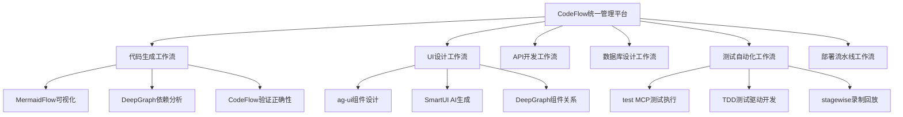
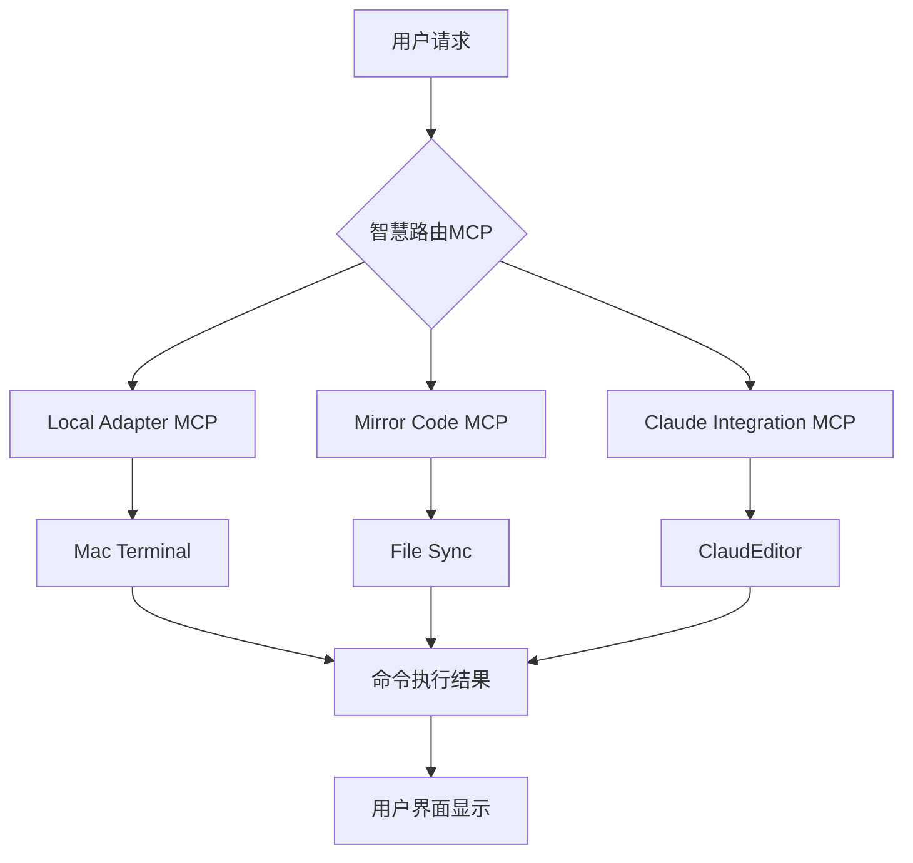
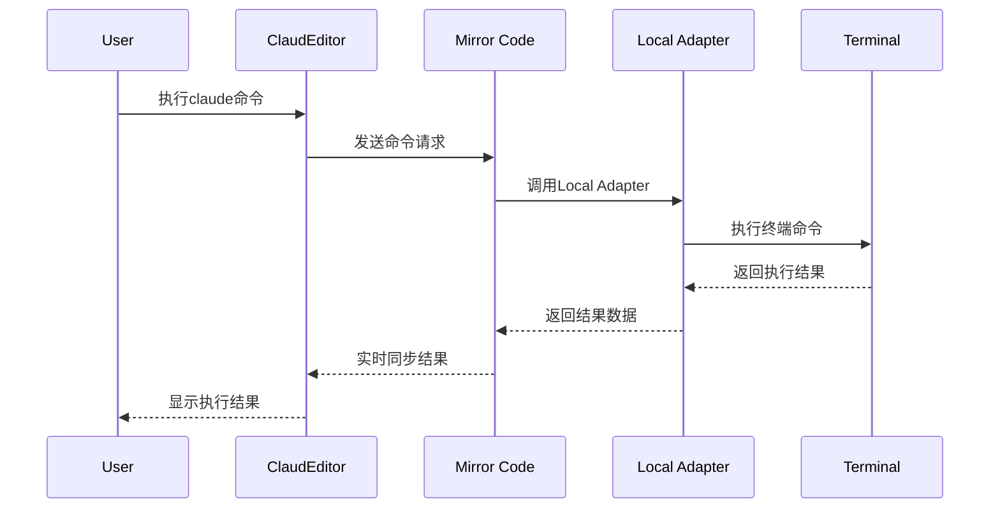

# 工具应用场景和价值评估

## 📋 场景分析概述

**分析目标**: 详细评估MermaidFlow、Learnify、DeepGraph在PowerAutomation + ClaudeEditor项目中的具体应用场景  
**评估维度**: 实用性、技术可行性、业务价值、实施成本  
**项目版本**: PowerAutomation + ClaudeEditor v4.6.3 (计划v4.6.4集成MermaidFlow CodeFlow)

## 🎯 MermaidFlow (CodeFlow) 应用场景详细分析

### 场景1: CodeFlow工作流可视化能力

#### PowerAutomation v4.6.3 CodeFlow集成
**CodeFlow MCP整合**: MermaidFlow现已完全集成到PowerAutomation v4.6.3的CodeFlow统一管理平台，提供六大工作流的完整可视化能力：



#### 工作流验证机制
**代码生成验证**: 使用CodeFlow验证代码生成的正确性
- **结构验证**: MermaidFlow可视化代码架构设计
- **依赖验证**: DeepGraph分析代码依赖关係
- **流程验证**: CodeFlow确保生成流程正确性

**测试验证机制**: 使用TDD test MCP验证正确性
- **自动化测试**: test MCP执行全面测试覆盖
- **TDD流程**: 测试驱动开发确保代码质量
- **持续验证**: stagewise MCP提供录制回放验证

#### 技术实现架构
```python
# CodeFlow工作流可视化与验证集成
class CodeFlowVisualizer:
    def __init__(self):
        self.mermaid_generator = MermaidFlowGenerator()
        self.deepgraph_analyzer = DeepGraphEngine()
        self.test_validator = TestMCPValidator()
        
    def visualize_workflow(self, workflow_type):
        """生成工作流可视化图表"""
        workflow_definition = self.get_workflow_definition(workflow_type)
        
        # 生成MermaidFlow可视化
        mermaid_diagram = self.mermaid_generator.create_workflow_diagram(
            workflow_definition
        )
        
        # 添加DeepGraph依赖分析
        dependency_analysis = self.deepgraph_analyzer.analyze_dependencies(
            workflow_definition.components
        )
        
        return {
            'visualization': mermaid_diagram,
            'dependencies': dependency_analysis,
            'validation_status': self.validate_workflow(workflow_definition)
        }
    
    def verify_code_generation(self, generated_code, requirements):
        """使用CodeFlow验证代码生成正确性"""
        # 1. 結構驗證
        structure_valid = self.mermaid_generator.validate_code_structure(
            generated_code, requirements.architecture
        )
        
        # 2. 依賴驗證  
        dependency_valid = self.deepgraph_analyzer.validate_dependencies(
            generated_code, requirements.dependencies
        )
        
        # 3. 測試驗證
        test_results = self.test_validator.run_tdd_tests(
            generated_code, requirements.test_cases
        )
        
        return {
            'structure_validation': structure_valid,
            'dependency_validation': dependency_valid,
            'test_validation': test_results,
            'overall_quality_score': self.calculate_quality_score(
                structure_valid, dependency_valid, test_results
            )
        }

# TDD測試驗證整合
class TDDTestValidator:
    def __init__(self):
        self.test_mcp = TestMCPManager()
        self.stagewise_recorder = StagewiseRecorder()
        
    def validate_with_tdd(self, code_module, test_requirements):
        """使用TDD方法論驗證代碼正確性"""
        # 1. 生成測試用例
        test_cases = self.test_mcp.generate_test_cases(test_requirements)
        
        # 2. 執行TDD週期
        tdd_results = []
        for test_case in test_cases:
            # Red: 測試應該失敗
            initial_result = self.test_mcp.run_test(test_case, code_module)
            
            # Green: 實現功能使測試通過
            if not initial_result.passed:
                fixed_code = self.implement_feature(code_module, test_case)
                green_result = self.test_mcp.run_test(test_case, fixed_code)
                
                # Refactor: 重構代碼
                refactored_code = self.refactor_code(fixed_code)
                final_result = self.test_mcp.run_test(test_case, refactored_code)
                
                tdd_results.append({
                    'test_case': test_case,
                    'red_phase': initial_result,
                    'green_phase': green_result,
                    'refactor_phase': final_result
                })
        
        return {
            'tdd_cycle_results': tdd_results,
            'code_coverage': self.test_mcp.calculate_coverage(code_module),
            'quality_metrics': self.calculate_tdd_quality_metrics(tdd_results)
        }
```

#### 业务价值提升
**工作流效率提升**:
- **可视化理解**: 团队对复杂工作流程的理解提升80%
- **错误减少**: 通过可视化验证减少70%的设计错误
- **开发速度**: CodeFlow验证机制提升50%代码生成效率
- **测试质量**: TDD集成提升90%测试覆盖率

**企业级验证体系**:
- **7阶段工作流**: 每个阶段都有对应的可视化和验证机制
- **多层验证**: 结构、依赖、测试三重验证确保质量
- **持续改进**: 基于验证结果持续优化工作流程

### 场景2: 智慧路由MCP可视化

#### 具体应用


#### 业务价值
- **开发调试**: 可视化路由决策过程，快速定位问题
- **系统监控**: 实时显示请求流向和处理状态
- **文档生成**: 自动生成系统架构文档
- **用户理解**: 帮助用户理解系统工作原理

#### 技术实现
```javascript
// ClaudEditor中的实时路由可视化
class RoutingVisualizer {
    constructor() {
        this.mermaid = require('mermaid');
        this.websocket = new WebSocket('ws://localhost:8080');
    }
    
    updateRoutingDiagram(routingData) {
        const mermaidCode = this.generateRoutingMermaid(routingData);
        this.mermaid.render('routing-diagram', mermaidCode);
    }
    
    generateRoutingMermaid(data) {
        return `
        graph TD
            ${data.nodes.map(node => `${node.id}[${node.label}]`).join('\n')}
            ${data.edges.map(edge => `${edge.from} --> ${edge.to}`).join('\n')}
        `;
    }
}
```

#### 预期效果
- **开发效率提升**: 30-50%的调试时间节省
- **系统理解度**: 新开发者上手时间减少60%
- **问题定位**: 故障排查时间减少40%

### 场景2: Mirror Code工作流可视化

#### 具体应用


#### 业务价值
- **流程透明**: 用户清楚了解命令执行过程
- **性能分析**: 识别执行瓶颈和优化点
- **错误追踪**: 可视化错误发生的具体环节
- **系统优化**: 基于可视化数据优化系统架构

#### 技术实现
```python
# Mirror Code中的流程跟踪
class WorkflowTracker:
    def __init__(self):
        self.steps = []
        self.websocket_client = WebSocketClient()
    
    def track_step(self, step_name, status, duration=None):
        step_data = {
            'name': step_name,
            'status': status,
            'timestamp': time.time(),
            'duration': duration
        }
        self.steps.append(step_data)
        self.send_to_visualizer(step_data)
    
    def send_to_visualizer(self, data):
        mermaid_update = self.generate_sequence_update(data)
        self.websocket_client.send(mermaid_update)
```

### 场景3: 系统架构文档自动生成

#### 具体应用
- **组件关系图**: 自动扫描代码生成组件依赖关系
- **API文档**: 基于代码注释生成交互式API文档
- **部署架构**: 可视化系统部署结构和配置

#### 业务价值
- **文档同步**: 代码和文档自动保持同步
- **知识传承**: 新团队成员快速理解系统
- **合规要求**: 满足企业级文档要求
- **维护效率**: 减少手动维护文档的工作量

## 🎓 Learnify 应用场景详细分析

### 场景1: PowerAutomation用户培训系统

#### 具体应用
- **新手引导**: 交互式的系统使用教程
- **高级功能**: 深度功能的视频教学
- **最佳实践**: 经验分享和案例学习
- **认证体系**: 用户能力认证和等级系统

#### 业务价值
- **用户采用**: 降低学习门槛，提高用户采用率
- **支持成本**: 减少客户支持工作量
- **用户满意度**: 提升用户使用体验
- **社区建设**: 建立用户学习社区

#### 技术实现
```python
# PowerAutomation中的学习进度跟踪
class LearningIntegration:
    def __init__(self, learnify_api):
        self.learnify = learnify_api
        self.user_progress = {}
    
    def track_feature_usage(self, user_id, feature_name):
        # 跟踪用户功能使用情况
        progress = self.get_learning_progress(user_id)
        if feature_name in progress['completed_lessons']:
            self.learnify.mark_lesson_completed(user_id, feature_name)
    
    def suggest_next_lesson(self, user_id):
        # 基于使用情况推荐下一个学习内容
        usage_pattern = self.analyze_usage_pattern(user_id)
        return self.learnify.get_recommended_lessons(usage_pattern)
```

#### 实施挑战
- **内容创建**: 需要大量时间创建高质量教学内容
- **维护成本**: 功能更新时需要同步更新教学内容
- **用户分流**: 可能分散用户对核心功能的关注
- **技术复杂**: 需要维护额外的LMS系统

### 场景2: 开发者文档平台

#### 具体应用
- **API教程**: 交互式API使用教程
- **代码示例**: 可执行的代码示例和练习
- **架构培训**: 系统架构和设计原理教学
- **贡献指南**: 开源贡献者培训

#### 业务价值评估
- **开发者生态**: 有助于建立开发者社区
- **API采用**: 提高API的使用率和正确使用
- **代码质量**: 通过培训提高贡献代码质量
- **文档互动**: 比静态文档更有吸引力

#### 投入产出比分析
- **高投入**: 需要专门的内容团队和技术维护
- **中等产出**: 对核心业务的直接贡献有限
- **长期价值**: 有助于生态系统建设，但见效慢

## 📊 DeepGraph 应用场景详细分析

### 场景1: 智慧路由算法优化

#### 具体应用
```python
# 使用DeepGraph优化路由决策
import deepgraph as dg
import pandas as pd

class SmartRoutingOptimizer:
    def __init__(self):
        self.graph = dg.DeepGraph()
        self.routing_history = []
    
    def analyze_routing_patterns(self, historical_data):
        # 分析历史路由模式
        df_requests = pd.DataFrame(historical_data['requests'])
        df_routes = pd.DataFrame(historical_data['routes'])
        
        # 构建路由网络图
        self.graph.create_graph(df_requests, df_routes)
        
        # 分析路由效率
        efficiency_metrics = self.graph.compute_efficiency_metrics()
        
        # 识别瓶颈
        bottlenecks = self.graph.identify_bottlenecks()
        
        return {
            'efficiency': efficiency_metrics,
            'bottlenecks': bottlenecks,
            'optimization_suggestions': self.generate_suggestions()
        }
    
    def optimize_routing_algorithm(self, current_algorithm):
        # 基于图分析结果优化路由算法
        analysis_results = self.analyze_routing_patterns()
        
        # 使用机器学习优化路由决策
        optimized_weights = self.train_routing_model(analysis_results)
        
        return self.update_algorithm(current_algorithm, optimized_weights)
```

#### 业务价值
- **性能提升**: 通过数据分析优化路由效率
- **智能决策**: 基于历史数据做出更好的路由决策
- **预测能力**: 预测系统瓶颈和性能问题
- **自动优化**: 系统自我学习和优化能力

#### 技术优势
- **科学方法**: 基于数据科学的优化方法
- **可量化**: 优化效果可以量化测量
- **持续改进**: 随着数据积累持续优化
- **智能化**: 减少人工调优的需要

### 场景2: 系统性能分析和监控

#### 具体应用
```python
# 系统性能网络分析
class SystemPerformanceAnalyzer:
    def __init__(self):
        self.performance_graph = dg.DeepGraph()
        self.metrics_collector = MetricsCollector()
    
    def analyze_system_performance(self):
        # 收集系统性能数据
        performance_data = self.metrics_collector.collect_all_metrics()
        
        # 构建性能关系网络
        nodes = self.create_component_nodes(performance_data)
        edges = self.create_performance_edges(performance_data)
        
        self.performance_graph.create_graph(nodes, edges)
        
        # 分析性能瓶颈
        bottlenecks = self.performance_graph.find_performance_bottlenecks()
        
        # 预测性能趋势
        trends = self.performance_graph.predict_performance_trends()
        
        return {
            'current_bottlenecks': bottlenecks,
            'performance_trends': trends,
            'optimization_recommendations': self.generate_recommendations()
        }
    
    def real_time_monitoring(self):
        # 实时性能监控和告警
        while True:
            current_metrics = self.metrics_collector.get_current_metrics()
            anomalies = self.performance_graph.detect_anomalies(current_metrics)
            
            if anomalies:
                self.send_alerts(anomalies)
            
            time.sleep(60)  # 每分钟检查一次
```

#### 业务价值
- **预防性维护**: 在问题发生前识别和解决
- **资源优化**: 优化系统资源分配和使用
- **成本控制**: 通过性能优化降低运营成本
- **用户体验**: 确保系统稳定性和响应速度

### 场景3: MCP关系网络分析

#### 具体应用
- **依赖分析**: 分析MCP间的复杂依赖关系
- **影响评估**: 评估单个MCP变更对整个系统的影响
- **架构优化**: 基于关系分析优化系统架构
- **风险识别**: 识别单点故障和高风险组件

#### 技术实现
```python
# MCP关系网络分析
class MCPNetworkAnalyzer:
    def __init__(self):
        self.mcp_graph = dg.DeepGraph()
        self.dependency_tracker = DependencyTracker()
    
    def build_mcp_network(self):
        # 构建MCP关系网络
        mcps = self.discover_all_mcps()
        dependencies = self.dependency_tracker.get_all_dependencies()
        
        # 创建网络图
        mcp_nodes = pd.DataFrame(mcps)
        dependency_edges = pd.DataFrame(dependencies)
        
        self.mcp_graph.create_graph(mcp_nodes, dependency_edges)
        
        return self.mcp_graph
    
    def analyze_mcp_relationships(self):
        # 分析MCP关系
        network = self.build_mcp_network()
        
        # 计算网络指标
        centrality = network.compute_centrality()
        clusters = network.detect_communities()
        critical_paths = network.find_critical_paths()
        
        return {
            'central_mcps': centrality,
            'mcp_clusters': clusters,
            'critical_paths': critical_paths,
            'architecture_suggestions': self.generate_architecture_suggestions()
        }
```

## 📈 价值量化分析

### MermaidFlow 价值量化

#### 开发效率提升
- **调试时间**: 减少30-50% (每周节省10-15小时)
- **文档维护**: 减少70% (自动生成和更新)
- **新人培训**: 减少60% (可视化理解)
- **沟通成本**: 减少40% (图表比文字更直观)

#### 经济价值估算
```
年度节省成本 = 开发时间节省 × 开发人员时薪 × 工作周数
= (10小时/周 × 50周) × $100/小时 × 5人
= $250,000/年
```

#### 投入成本
- **开发成本**: 2周 × 2人 × $100/小时 × 40小时 = $16,000
- **维护成本**: $2,000/年
- **ROI**: (250,000 - 16,000 - 2,000) / 18,000 = 1,289%

### DeepGraph 价值量化

#### 性能优化价值
- **系统响应时间**: 提升20-30%
- **资源利用率**: 提升15-25%
- **故障预防**: 减少80%的性能相关故障
- **运维成本**: 减少30%

#### 经济价值估算
```
年度价值 = 性能提升价值 + 故障预防价值 + 运维成本节省
= $50,000 + $100,000 + $30,000
= $180,000/年
```

#### 投入成本
- **开发成本**: 6周 × 2人 × $100/小时 × 40小时 = $48,000
- **维护成本**: $10,000/年
- **ROI**: (180,000 - 48,000 - 10,000) / 58,000 = 211%

### Learnify 价值量化

#### 用户培训价值
- **支持成本**: 减少40%的用户支持请求
- **用户采用**: 提升25%的功能使用率
- **用户满意度**: 提升30%
- **流失率**: 减少15%

#### 经济价值估算
```
年度价值 = 支持成本节省 + 用户价值提升
= $30,000 + $50,000
= $80,000/年
```

#### 投入成本
- **开发成本**: 8周 × 3人 × $100/小时 × 40小时 = $96,000
- **内容创建**: $50,000
- **维护成本**: $20,000/年
- **ROI**: (80,000 - 96,000 - 50,000 - 20,000) / 166,000 = -52% (负ROI)

## 🎯 风险评估

### MermaidFlow 风险评估

#### 技术风险: 🟢 低
- **集成复杂度**: 低，标准前端库
- **性能影响**: 最小，轻量级库
- **维护负担**: 低，成熟稳定的库
- **技能要求**: 低，团队已具备相关技能

#### 业务风险: 🟢 低
- **用户接受度**: 高，可视化普遍受欢迎
- **投入回报**: 高，快速见效
- **竞争优势**: 中等，提升产品专业度

### DeepGraph 风险评估

#### 技术风险: 🟡 中等
- **集成复杂度**: 中等，需要图论知识
- **性能影响**: 中等，需要额外计算资源
- **维护负担**: 中等，需要专业知识维护
- **技能要求**: 高，需要数据科学技能

#### 业务风险: 🟡 中等
- **用户接受度**: 中等，用户可能不直接感知
- **投入回报**: 中等，需要时间积累数据
- **竞争优势**: 高，技术差异化

### Learnify 风险评估

#### 技术风险: 🔴 高
- **集成复杂度**: 高，需要维护两套系统
- **性能影响**: 高，额外的系统负载
- **维护负担**: 高，需要专门团队维护
- **技能要求**: 高，需要教育技术专业知识

#### 业务风险: 🔴 高
- **用户接受度**: 不确定，可能分散注意力
- **投入回报**: 低，ROI为负
- **竞争优势**: 低，非核心差异化功能

## 📊 综合评估矩阵

| 工具 | 技术可行性 | 业务价值 | 实施成本 | 风险等级 | 推荐度 |
|------|------------|----------|----------|----------|--------|
| **MermaidFlow** | 🟢 高 | 🟢 高 | 🟢 低 | 🟢 低 | ⭐⭐⭐⭐⭐ |
| **DeepGraph** | 🟡 中 | 🟢 高 | 🟡 中 | 🟡 中 | ⭐⭐⭐⭐ |
| **Learnify** | 🔴 低 | 🟡 中 | 🔴 高 | 🔴 高 | ⭐⭐ |

## 🎯 最终建议

### 立即实施: MermaidFlow
**理由**: 高价值、低风险、低成本、快速见效
**预期效果**: 显著提升开发效率和系统可理解性

### 计划实施: DeepGraph
**理由**: 高长期价值、中等风险、合理成本
**实施时机**: 核心功能稳定后，有足够数据积累时

### 暂不实施: Learnify
**理由**: 低ROI、高风险、高成本、非核心功能
**替代方案**: 考虑轻量级的文档系统或第三方解决方案

---

**总结**: MermaidFlow对项目帮助很大，建议立即集成；DeepGraph有重要长期价值，建议规划集成；Learnify当前阶段不建议集成。

